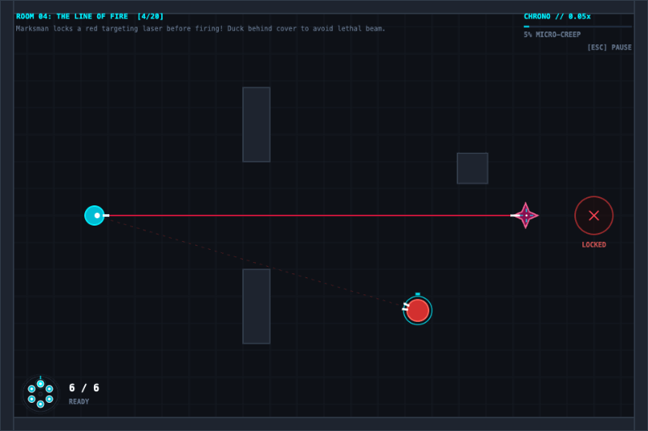

# ChronoShot ⏱️💥

> A top-down tactical arcade puzzle-shooter where **time moves only when you move**.

[](https://github.com/k-electron/chronoshot/actions/workflows/ci.yml)
[](https://chronoshot.pages.dev)
[](https://opensource.org/licenses/MIT)
[](https://www.typescriptlang.org/)
[](https://vitejs.dev/)
[]()

---

<p align="center">
  <a href="https://chronoshot.pages.dev/">
    
  </a>
</p>

<p align="center">
  <a href="https://chronoshot.pages.dev/">
    
  </a>
  <br />
  <sub>⚡ Zero install required &bull; 60 Hz deterministic simulation &bull; Playable in any desktop browser</sub>
</p>

---

## 🎮 Overview

**ChronoShot** translates tactical time-dilation puzzle mechanics into the twitch-and-flank readability of a top-down geometric roguelike shooter.

Every step you take accelerates global time. When you stop, time slows to a **5% micro-creep**, allowing you to read bullet trajectories, weave through crossfires, and line up precision shots. Firing expends ammo with an instantaneous recoil burst, while reloading anchors your chassis for **30 simulation ticks**—forcing you to sprint behind cover before cycling chambers.

Conquer 20 handcrafted combat rooms across four distinct sectors, defeat 4 multi-phase milestone bosses, draft tactical augmentations in freeze-frame triumph, and unlock the infinite Endless Survival Mode in the Apex Colosseum.

---

## 🕹️ Controls

| Input | Action |
|---|---|
| <kbd>W</kbd> <kbd>A</kbd> <kbd>S</kbd> <kbd>D</kbd> | Move (Smoothly accelerates time from 5% to 100%) |
| <kbd>Mouse</kbd> | 360° Hardware Aim Reticle (Does not advance time) |
| <kbd>Left Click</kbd> | Fire Revolver (+6 simulation ticks) / Select Cards |
| <kbd>Space</kbd> / <kbd>Shift</kbd> | Overcharge Dash (+12 tick burst, 480 px/s sprint, deflection frames) |
| <kbd>R</kbd> | Reload Revolver / Checkpoint Rollback on Defeat |
| <kbd>Shift</kbd> + <kbd>R</kbd> | Quick Restart Current Room / Full Expedition Reset |
| <kbd>1</kbd> <kbd>2</kbd> <kbd>3</kbd> | Select Tactical Augmentation during Post-Boss Draft |
| <kbd>E</kbd> / <kbd>Space</kbd> | Select Endless Protocol on Campaign Victory Screen |
| <kbd>Esc</kbd> / <kbd>P</kbd> | Toggle Tactical Pause & Controls Matrix |
| <kbd>M</kbd> | Toggle Audio Mute |

---

## 🏗️ Architecture & Engine Philosophy

ChronoShot is deliberately built from scratch without third-party game engines (no Phaser, Pixi.js, or Three.js).

- **Simulation**: Deterministic 60 Hz fixed-step physics (`FixedStepSimulator`) decoupled from display refresh rates.
- **Render Interpolation**: Sub-tick coordinate smoothing (`lerp(prev, curr, alpha)`) delivers judder-free visual motion across 60Hz–240Hz+ displays.
- **Ballistics**: Continuous Collision Detection (CCD) line-segment raycasts eliminate projectile tunneling.
- **Procedural Audio**: 100% synthesized in real time via Web Audio API—zero external audio binaries (`.mp3`/`.wav`) with continuous dynamic pitch dilation.
- **AI Navigation**: $48 \times 32$ tile-grid A* pathfinding paired with continuous swept-circle physical clearance and anti-freeze tangent deflectors.

```
+-------------------------------------------------------------------------+
|                        BROWSER INPUT & WINDOW                           |
|       (Keyboard: WASD, R, Space | Mouse: Screen Coords, Left Click)     |
+-------------------------------------------------------------------------+
                                    |
                                    v
+-------------------------------------------------------------------------+
|                           TIME GOVERNOR                                 |
|  - Tracks player movement speed to calculate timeScale [0.05 .. 1.0]     |
|  - Queues immediate tick bursts for Fire (+6) and Reload (+30)          |
|  - Converts wall-clock deltaTime into simulation accumulator ticks      |
+-------------------------------------------------------------------------+
                                    |
                                    v  (discrete ticks)
+-------------------------------------------------------------------------+
|                       FIXED-STEP SIMULATOR                              |
|  - Fixed 60 Hz physics loop decoupled from rendering framerate          |
|  - Continuous Collision Detection (Raycasts against Obstacles & Hitboxes)|
|  - Enemy AI Decision Cycles (Line-of-Sight, Firing Timers)              |
|  - Room State & Victory / Defeat Evaluations                            |
+-------------------------------------------------------------------------+
                                    |
                                    v  (interpolated frame state)
+-------------------------------------------------------------------------+
|                       CANVAS 2D RENDERER                                |
|  - High-contrast geometric minimalism (Cyan Player, Crimson Enemies)    |
|  - Glowing bullet tracers, fading trails, and crystalline shatter shards |
|  - Interactive Revolver Cylinder HUD & Time Dilation Meter              |
+-------------------------------------------------------------------------+
```

---

## 🚀 Quickstart

### Prerequisites
- [Node.js](https://nodejs.org/) (v18+; Node 26 recommended via `.nvmrc`)
- `npm`

### Local Development
```bash
# Clone the repository
git clone https://github.com/k-electron/chronoshot.git
cd chronoshot

# Install dependencies and start Vite dev server
npm install
npm run dev
```

Visit `http://localhost:5173` in your browser.

### Running Tests
ChronoShot features an outcome-based automated test suite verifying physics, time dilation, weapons, AI steering, and progression:

```bash
# Run unit & integration test suite (760+ tests in ~1.0s)
npm test

# Run tests in continuous watch mode
npm run test:watch
```

---

## 📚 Documentation

- **[OpenSpec Specifications](openspec/specs/)**: Authoritative requirements and behavioral scenarios for [combat arena](openspec/specs/combat-arena/spec.md), [time dilation](openspec/specs/time-engine/spec.md), [weapons](openspec/specs/weapon-system/spec.md), [boss encounters](openspec/specs/boss-encounters/spec.md), [tactical upgrades](openspec/specs/roguelike-upgrades/spec.md), and [campaign levels](openspec/specs/procedural-levels/spec.md).
- **[AGENTS.md](AGENTS.md)**: Deep architectural patterns, sub-tick interpolation math, AI movement steering, and AI coding conventions.
- **[CONTRIBUTING.md](CONTRIBUTING.md)**: Development setup, commit standards, pull request workflow, and Cloudflare Pages deployment configuration.

---

## 📄 License

This project is licensed under the [MIT License](LICENSE).
